# AlmailBooks

Invoices, bills, expenses, accounting and reports for your business, with
modern professional templates. Built by AL Mail Group. The whole app runs in the
browser and is hosted free on GitHub Pages: there is no server, no account and
no monthly fee. Your records stay on your own computer.

**Open the app:** https://almailgroup.github.io/AlmailBooks/

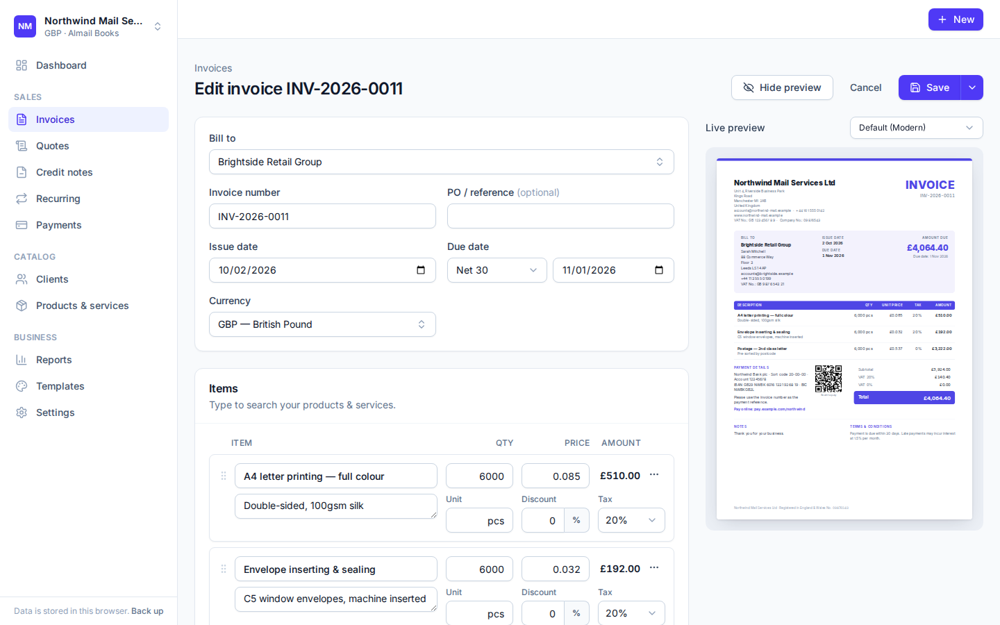

## Features

- **Invoices, quotes and credit notes.** Convert an accepted quote into an
  invoice in one click. Apply a credit note to an open invoice.
- **10 PDF templates**: Modern, Minimal, Corporate, Elegant, Bold, Classic,
  Creative, Compact, Gradient and Mono. Each uses your logo, brand colour and
  font. PDFs are made in the browser, with a live preview while you type.
- **Taxes done properly.** You can have several tax rates (e.g. VAT 20% / 5% / 0%),
  apply them per line or to the whole document, and use prices with or without
  tax. Each rate has a kind (standard, reduced, zero-rated, exempt, reverse
  charge or outside the scope) that decides where it goes on a VAT return.
  Line and document discounts, extra charges (such as delivery) and deposits
  are supported.
- **Payments.** Record full or partial payments, spread one payment across
  several invoices, and email receipts. Statuses (sent, partially paid, paid,
  overdue) update automatically.
- **Recurring invoices.** Choose weekly to yearly schedules. Placeholders such
  as `:MONTH :YEAR` fill in the period, and the invoices are created when you
  open the app.
- **Clients and products.** Clients have contacts, billing and shipping
  addresses, their own currency, language, payment terms and tax exemption.
  The product and service catalogue autocompletes in the editor.
- **Purchases.** Record vendors' bills line by line against expense or asset
  accounts, attach a photo or PDF of the bill, pay them in full or in part
  (from the bank, cash or a company card) and apply vendor credits. Expenses
  paid on the spot are recorded with a photo of the receipt. A contact can be
  both a client and a vendor.
- **Numbering** with patterns like `INV-{year}-{counter}`, with a yearly or
  monthly reset, for every kind of document.
- **Languages for documents:** English, French, Spanish, German, Portuguese,
  Italian and Dutch. You can also replace any wording (for example "Tax
  Invoice").
- **Email:** opens your email program with a ready-made message and downloads
  the PDF to attach. You can send reminders the same way.
- **Double-entry accounting:** a chart of accounts (UK, UAE or general
  templates), automatic journal entries for every invoice, credit note, bill,
  vendor credit, payment and expense, manual journals, exchange gains and
  losses on foreign-currency payments, a financial year setting and a lock
  date for closed periods.
- **Financial statements:** profit and loss, balance sheet, trial balance and
  general ledger, with drill-down from any account to its transactions.
- **VAT returns:** the UK return (boxes 1–9), the UAE VAT 201 return, or a
  summary for other countries, worked out for each monthly or quarterly
  period. Every box lists the documents behind it. Reverse charge on services
  bought from abroad is handled. Marking a return as filed moves the period's
  VAT to the VAT liability account and can lock the period; the payment or
  refund is recorded against it. AlmailBooks does not submit returns itself:
  you enter the figures with HMRC's Making Tax Digital software or online
  service, or on the FTA EmaraTax portal.
- **Dashboard and reports:** what clients owe you and what you owe vendors,
  overdue amounts, receivables and payables aging, tax summary, sales by
  client, purchases by vendor, payments received and made, with CSV export.
- **Several companies** in one app, each with its own branding and numbering.
- **Works offline** and can be installed like a desktop or phone app.
- **Backup and restore** to a single file.

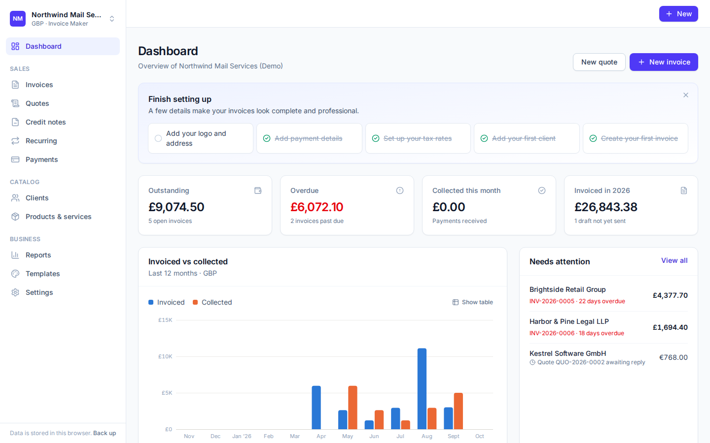

### Templates

|                               Modern                               |                               Minimal                                |                               Corporate                                |                               Elegant                                |                             Bold                             |
| :----------------------------------------------------------------: | :------------------------------------------------------------------: | :--------------------------------------------------------------------: | :------------------------------------------------------------------: | :----------------------------------------------------------: |
|  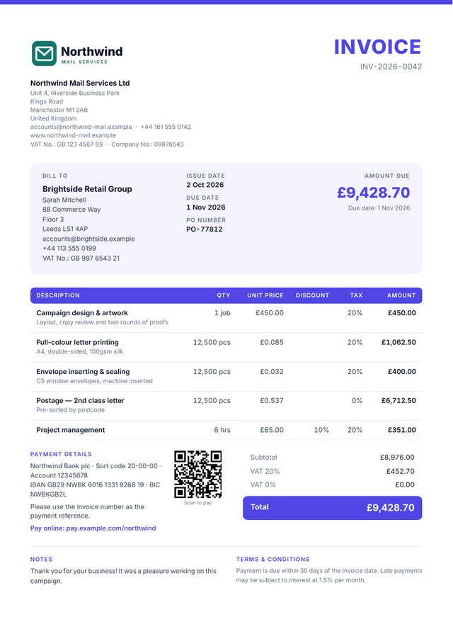  |  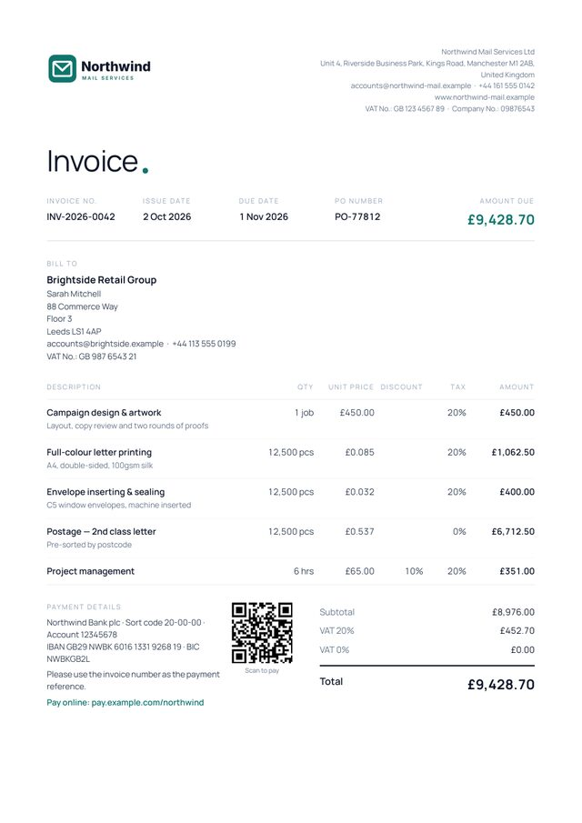  | 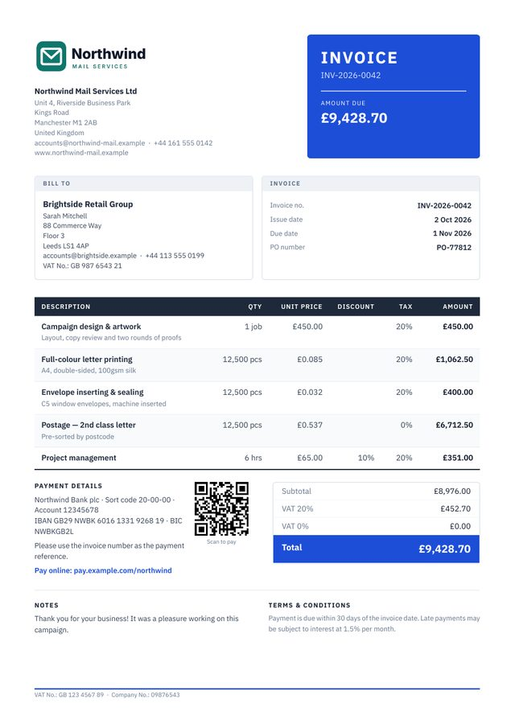 |  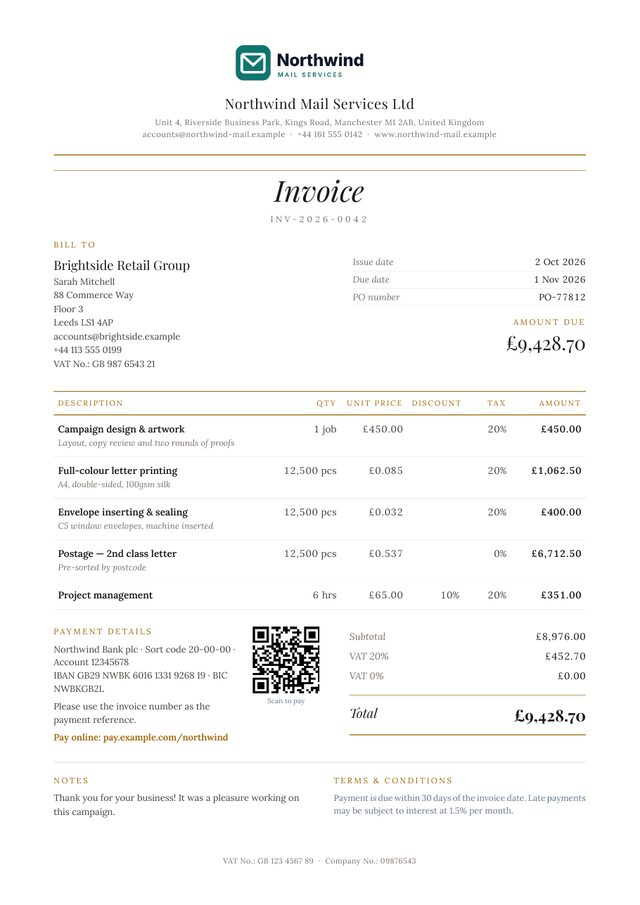  | 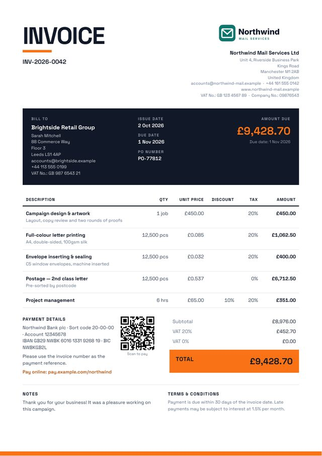 |
|                            **Classic**                             |                             **Creative**                             |                              **Compact**                               |                             **Gradient**                             |                           **Mono**                           |
| 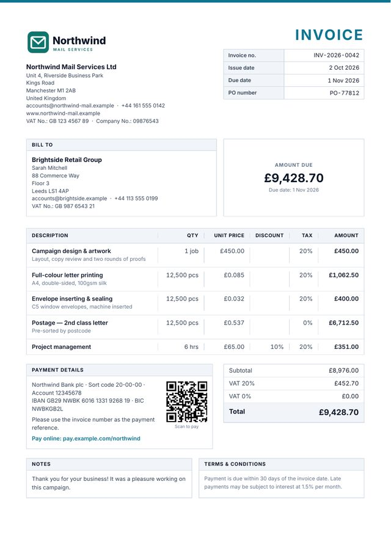 | 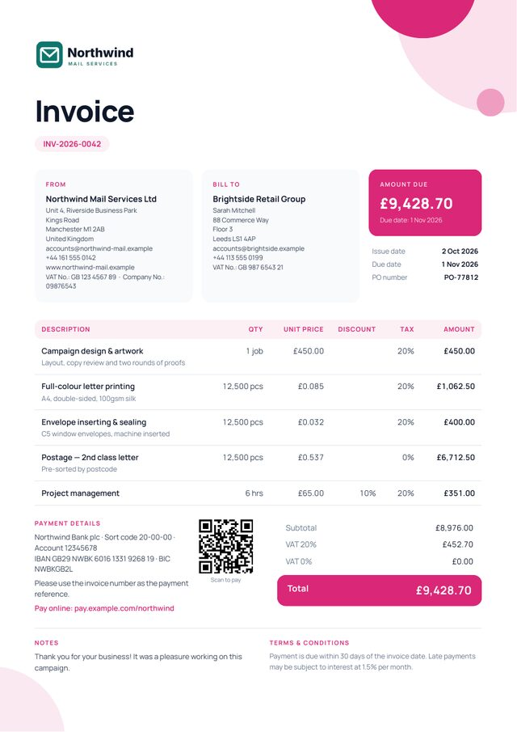 |   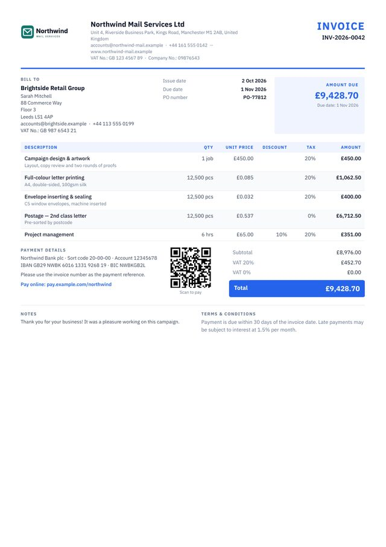   | 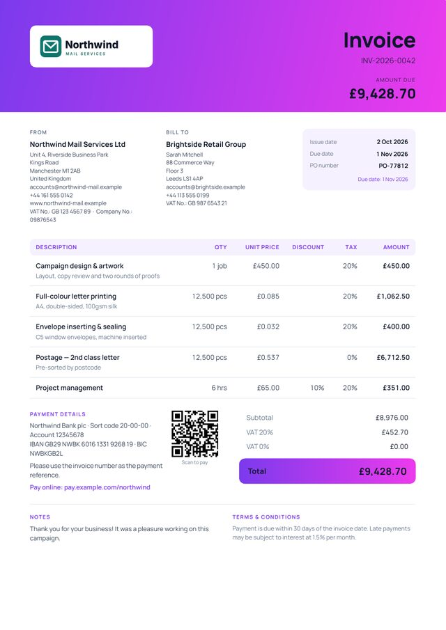 | 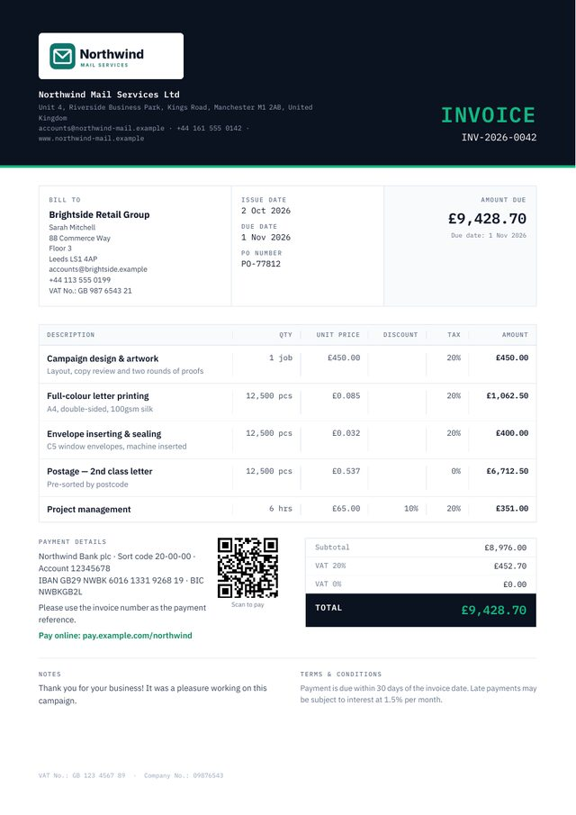 |

## Put it online with GitHub Pages (one-time setup)

1. In this repository on GitHub, open **Settings → Pages**.
2. Under **Build and deployment → Source**, choose **GitHub Actions**.
3. Open the **Actions** tab, select **Build and deploy to GitHub Pages**, and
   click **Run workflow**. Pushing any commit to `main` also starts it.
4. When the run finishes (about 2 minutes), the app is live at
   https://almailgroup.github.io/AlmailBooks/.

From then on, every push to `main` runs the checks (lint, formatting, type
check, unit tests, build and browser tests) and publishes the new version if
they pass. Before Pages is switched on, the workflow still runs the checks and
skips the deployment with a notice.

To use your own domain (e.g. `books.almailgroup.com`), enter it under
**Settings → Pages → Custom domain** and follow GitHub's DNS instructions. The
app uses relative paths, so it works on any domain or sub-path. Browsers keep
data per site, so **back up before switching to a new domain** and restore the
backup at the new address.

Renaming the repository changes only the path
(`almailgroup.github.io/<repository>/`), not the site, so saved data is still
there at the new address. If you installed the app, install it again from the
new address.

## Where your data lives

- Everything you enter is stored in your browser (IndexedDB) on the computer
  you use. Nothing is sent to a server; GitHub Pages only delivers the app
  itself.
- The site is public, but other visitors see an empty app with their own
  storage. They cannot see your invoices.
- **Each browser has its own data.** Back up regularly from **Settings → Data
  → Back up**. To move to another computer, open the app there and choose
  **Restore a backup** on the welcome screen.
- Clearing your browser's site data deletes the records. The app asks the
  browser to protect its storage, and installing the app makes this more
  reliable.

## Offline and installing

After the first visit the app works without an internet connection, including
PDF creation. To install it, use the install icon in the address bar (Chrome,
Edge) or **Share → Add to Home Screen** (Safari on iPhone and iPad). When a new
version is published, the app shows a **Reload** button instead of reloading
on its own, so unsaved work is never lost.

## Development

Requires Node.js 22.12 or newer (see `.nvmrc`).

```bash
npm install
npm run dev         # development server at http://localhost:5173
npm test            # unit tests (Vitest)
npm run test:e2e    # production build + browser tests (Playwright)
npm run lint        # ESLint
npm run typecheck   # TypeScript
npm run format      # Prettier (CI runs `npm run format:check`)
npm run build       # production build in dist/
npm run preview     # serve dist/ locally
```

The first time you run the browser tests, install Chromium with
`npx playwright install chromium`.

### Project layout

```
src/
  app/          app shell, routing, active company, offline support
  pages/        screens: dashboard, documents, clients, payments, reports, settings
  features/     invoice editor, client and payment dialogs
  components/   UI building blocks, PDF preview, charts
  db/           IndexedDB schema (Dexie), documents, payments, accounting, backup, demo data
  lib/          money and tax calculation, ledger and financial statements, numbering, dates
  pdf/          PDF templates (react-pdf), fonts, document wording, PDF worker
e2e/            browser tests
scripts/        regenerate fonts, template thumbnails and app icons
```

### Changing templates and assets

- Each template is a file in `src/pdf/templates/`, built from the shared
  pieces in `shared.tsx`. Names and descriptions are in
  `src/pdf/template-meta.ts`.
- Render sample PDFs and PNGs:
  `npx tsx --tsconfig tsconfig.scripts.json scripts/render-templates.tsx out/ [template]`.
- Regenerate the gallery thumbnails with `scripts/make-thumbnails.sh` (needs
  poppler and ImageMagick).
- Regenerate the fonts with `scripts/subset-fonts.sh` (needs `pip install fonttools`).
- Regenerate the app icons from `public/favicon.svg` with `node scripts/make-icons.mjs`.

## Credits

The feature set was inspired by [Invoice Ninja](https://github.com/invoiceninja/invoiceninja).
No code was copied; Invoice Ninja is under the Elastic License 2.0. The fonts
are under the SIL Open Font License (see `src/pdf/fonts/LICENSE.md`).
